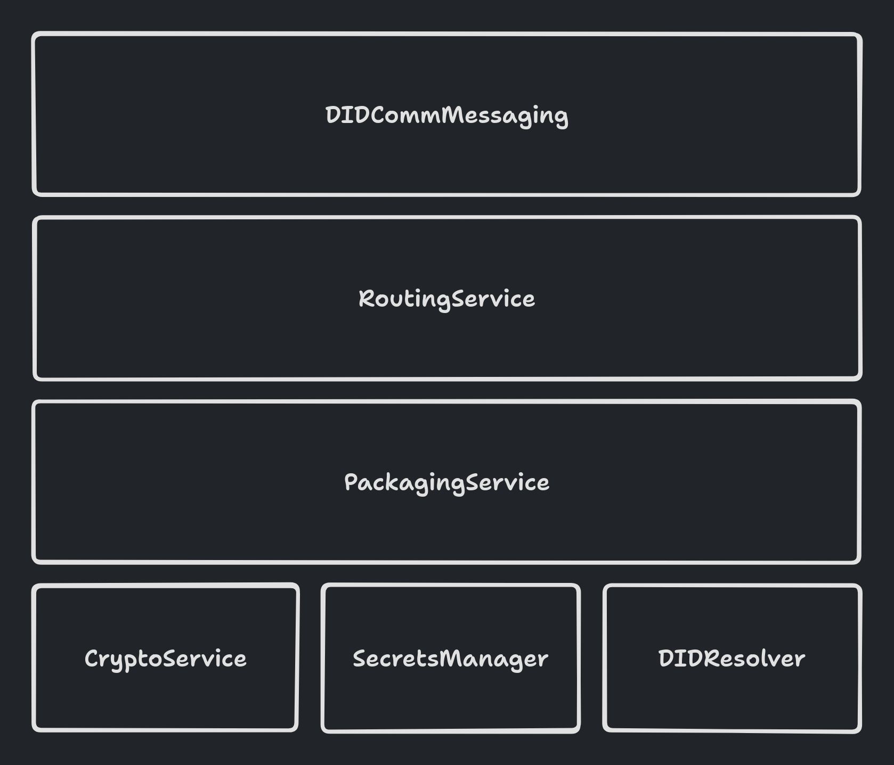

# didcomm-messaging-python

This is a minimal but flexible implementation of [DIDComm Messaging](https://identity.foundation/didcomm-messaging/spec/v2.1/). To learn more about DIDComm Messaging, check out the spec or visit [didcomm.org](https://didcomm.org) to learn about DIDComm Messaging protocols defined by the community.

## Usage

https://github.com/Indicio-tech/didcomm-messaging-python/blob/53a9a33e9bc503f13020dd9744d0a2763955af12/example.py#L1-L51

## Overview

This library has the following core components (as outlined in the layer cake architecture diagram above):

### CryptoService

The CryptoService provides the core cryptographic capabilities needed to encrypt and decrypt DIDComm Messages. This service is designed to be implemented by users of this library; however, an implementation using Aries Askar is available as an extra (install the `askar` extra to use it). Additional implementations may be added as extras in the future (i.e. an implementation using [Authlib's JWE implementation](https://docs.authlib.org/en/latest/jose/jwe.html) or perhaps an implementation backed by an HSM). The service is seprate from but closely coupled with the SecretsManager. Both must use the same public and private key representations.

> [!WARNING]
> TODO:
> - More details on implementing your own CryptoService
> - More details on using the included Askar CryptoService

### SecretsManager

The SecretsManager is responsible for retrieving secrets for use by the CryptoService. It is notable that the secret value need not literally contain the value of a private key. For example, in the included Askar implementation, an Askar `Key` value is retrieved. This object in python _does_ permit you to retrieve the bytes of the secret key from Askar if you choose; however, this is not necessary for the operation of the library. This enables Askar to keep the private key value down in the Rust layer where it can better ensure security of the key (zeroizing memory, etc.). This is not so distant from interacting with an HSM; as long as the `SecretKey` value retrieved by the SecretsManager can be used by the CryptoService to perform the required cryptographic operations, exactly what is stored inside of the `SecretKey` object is irrelevant.

> [!WARNING]
> TODO:
> - More details on implementing your own SecretsManager
> - More details on the included AskarSecretsManager

### DIDResolver

This component provides a fairly generic DID Resolution interface. Users of this library will provide a resolver implementation for the DID Methods they care about. Implementations of did:peer:2 and did:peer:4 are included as part of the `did_peer` extra.

> [!WARNING]
> TODO:
> - More details on PrefixResolver
> - More details on implementing your own DIDResolver

### PackagingService

The PackagingService is responsible for the core functions of packing and unpacking messages. It depends on the CryptoService, the SecretsManager, and the DIDResolver to accomplish this.

> [!WARNING]
> TODO:
> - More details on PackagingService

### RoutingService

The RoutingService is responsible for preparing messages for forwarding to a mediator. It depends on the PackagingService and the DIDResolver to accomplish this.

> [!WARNING]
> TODO:
> - More details on RoutingService

### DIDCommMessaging

The DIDCommMessaging interface is the main entrypoint for interacting with this library. It utilizes all the layers below to prepare messages for other parties.

> [!WARNING]
> TODO:
> - More details on DIDCommMessaging
